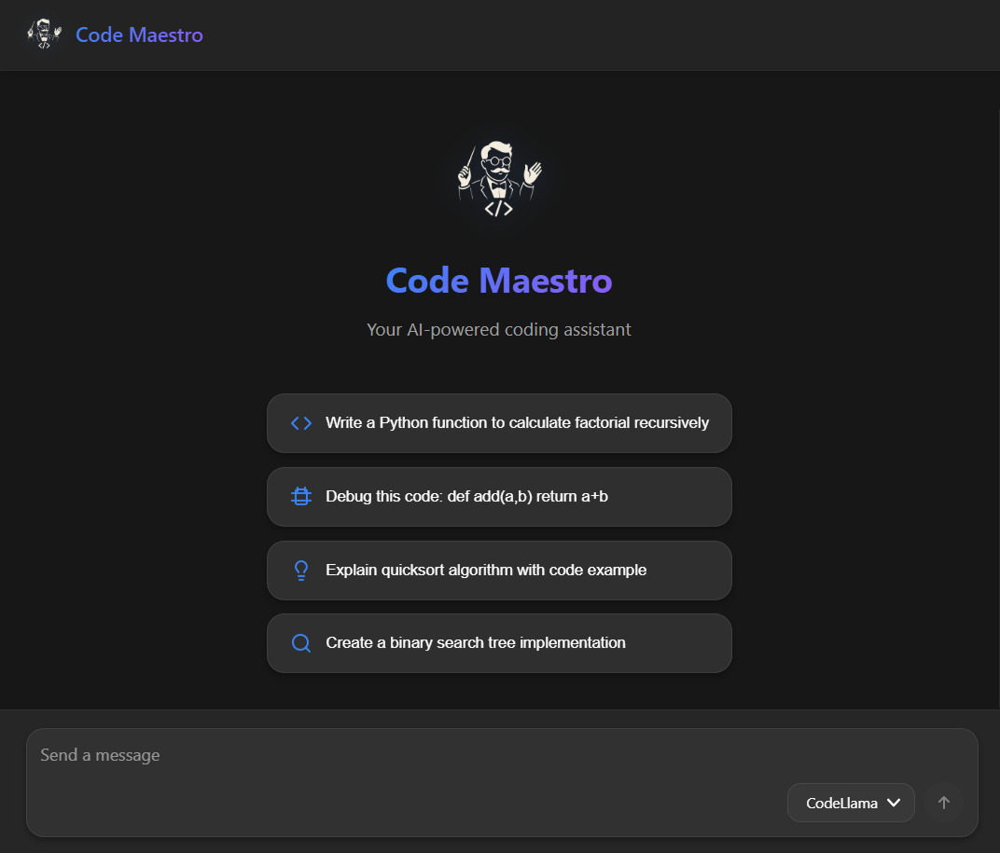

# Code Maestro 🎯

> A modern, real-time AI-powered code assistant with streaming responses and premium UI


**Code Maestro** is a sophisticated AI code assistant that brings the power of local LLMs to your development workflow. With real-time streaming, an intuitive interface, and privacy-first design, it's like having an expert developer at your side 24/7.

## ✨ Features

### Core Capabilities
- 🚀 **Real-Time Streaming** - Watch responses generate character-by-character
- 💬 **Natural Conversations** - Context-aware multi-turn discussions
- 💻 **Syntax Highlighting** - Beautiful code blocks with copy-to-clipboard
- ⏹️ **Stop Anytime** - Cancel generation with one click
- 🔄 **Regenerate Responses** - Not satisfied? Try again instantly
- 🗑️ **Clear History** - Fresh start with a single click

### User Experience
- 🎨 **Modern Dark UI** - Eye-friendly design with smooth animations
- 📱 **Fully Responsive** - Perfect experience on any device
- ⚡ **Instant Feedback** - Loading states and streaming indicators
- 🎯 **Smart Suggestions** - Quick-start prompts to get you coding
- 🔌 **100% Local** - All processing happens on your machine via Ollama

### Technical Excellence
- 🔥 **Optimized Streaming** - Batched updates for smooth performance
- 🎪 **Multiple Models** - Switch between CodeLlama, Llama 3.1, 3.2, and more
- 🛡️ **Error Handling** - Graceful degradation with helpful messages
- 📦 **Zero Configuration** - Works out of the box

## 🎥 Screenshots

### Chat Interface


### Code Generation


## 🏗️ Architecture

### Tech Stack

**Backend**
- **FastAPI** - High-performance async Python framework
- **Server-Sent Events (SSE)** - Real-time streaming protocol
- **Ollama Integration** - Local LLM inference
- **CORS Support** - Secure cross-origin requests

**Frontend**
- **Next.js 14** - React framework with App Router
- **React 18** - Modern hooks-based architecture
- **ReactMarkdown** - Rich markdown rendering with GFM support
- **CSS Modules** - Scoped styling with animations
- **Custom Components** - Reusable UI elements

## 📋 Prerequisites

Before you begin, ensure you have:

- **Python 3.8+** - [Download](https://www.python.org/downloads/)
- **Node.js 18+** - [Download](https://nodejs.org/)
- **Ollama** - [Install from ollama.ai](https://ollama.ai)
- **Git** - For cloning the repository

## 🚀 Quick Start

### 1. Install and Setup Ollama

```bash
# Download Ollama from https://ollama.ai

# Pull your preferred model
ollama pull codellama:latest

# Or try other models
ollama pull llama3.1:8b
ollama pull llama3.2:latest

# Start Ollama server (usually auto-starts)
ollama serve
```

### 2. Clone and Setup Backend

```bash
# Clone the repository
git clone https://github.com/yourusername/code-maestro.git
cd code-maestro

# Navigate to backend
cd backend

# Create virtual environment
python -m venv venv

# Activate virtual environment
# Windows:
venv\Scripts\activate
# macOS/Linux:
source venv/bin/activate

# Install dependencies
pip install -r requirements.txt

# Start backend server
python main.py
```

Backend will run on **http://localhost:8000**

### 3. Setup and Start Frontend

```bash
# Open new terminal and navigate to frontend
cd frontend

# Install dependencies
npm install

# Start development server
npm run dev
```

Frontend will run on **http://localhost:3000**

### 4. Start Coding!

1. Open your browser to **http://localhost:3000**
2. Select your model from the dropdown
3. Start chatting or try a suggested prompt
4. Watch the magic happen in real-time! ✨

## 📖 Usage Guide

### Example Prompts

**Code Generation**
```
Write a Python function to reverse a linked list
Create a React component for a todo list
Implement binary search in JavaScript
```

**Debugging**
```
Debug this code: [paste your code]
Why is this Python code throwing a TypeError?
Fix the memory leak in this C++ code
```

**Explanation**
```
Explain how async/await works in JavaScript
What's the difference between React hooks and class components?
How does the quicksort algorithm work?
```

**Conversion**
```
Convert this JavaScript to TypeScript
Translate this Python code to Go
Refactor this code to use modern ES6 syntax
```

### Keyboard Shortcuts

- **Enter** - Send message
- **Shift + Enter** - New line
- **Esc** - Clear input (when empty)

### Using the Interface

1. **Suggestion Pills** - Click to prefill prompts
2. **Model Selector** - Change AI model on the fly
3. **Stop Button** - Halt generation mid-stream
4. **Regenerate** - Retry the last response
5. **Clear Chat** - Start fresh conversation
6. **Copy Code** - One-click code copying from blocks

## 🎯 Advanced Features

### Multi-Turn Conversations

Code Maestro maintains context across messages:

```
You: Write a Python class for a binary tree
AI: [generates code]
You: Add a method to balance the tree
AI: [adds method with context]
You: Write unit tests for this class
AI: [creates tests for the entire class]
```

### Streaming Performance

The app uses optimized streaming with:
- **Batched Updates** - UI updates every 50ms instead of per-token
- **Smooth Scrolling** - Auto-scroll as content generates
- **Progressive Rendering** - Markdown renders in real-time

### Code Block Features

All code blocks include:
- Syntax highlighting
- Language detection
- Copy-to-clipboard button
- Horizontal scrolling for long lines

## 🔧 Configuration

### Backend Settings

Edit `backend/main.py`:

```python
# Ollama API URL
OLLAMA_URL = "http://localhost:11434"

# Streaming options
"options": {
    "temperature": 0.7,      # Creativity (0.0-1.0)
    "num_predict": 2000,     # Max response tokens
    "stop": ["```"]          # Stop sequences
}

# CORS origins
allow_origins=["http://localhost:3000"]
```

### Frontend Settings

Edit `frontend/pages/index.js`:

```javascript
// Backend API URL
const BACKEND_URL = 'http://localhost:8000';

// Streaming update interval (milliseconds)
const updateInterval = 50;

// Default models
const DEFAULT_MODELS = [
  'codellama:latest',
  'llama3.1:8b',
  'llama3.2:latest'
];
```

### Custom Styling

Colors are defined in `frontend/styles/Home.module.css`:

```css
/* Primary colors */
--color-bg-primary: #171717;
--color-bg-secondary: #262626;
--color-bg-tertiary: #404040;
--color-accent: #3b82f6;
--color-accent-purple: #8b5cf6;
```

## 🐛 Troubleshooting

### Ollama Not Running

```bash
# Check if Ollama is running
curl http://localhost:11434/api/tags

# If not, start it
ollama serve
```

### Backend Connection Issues

```bash
# Test backend health
curl http://localhost:8000/health

# Should return: {"status": "healthy"}

# Check available models
curl http://localhost:8000/models
```

### Streaming Not Working

1. Check browser console for errors
2. Verify backend CORS settings
3. Ensure Ollama model is pulled: `ollama list`
4. Try a different browser

### Slow Performance

**Solutions:**
- Use smaller models (7B instead of 34B)
- Reduce `num_predict` in backend settings
- Increase `updateInterval` in frontend
- Ensure adequate RAM (8GB+ recommended)

### Inline Code Rendering Issues

If inline code appears as blocks:
- Clear browser cache
- Check ReactMarkdown version
- Verify CSS is loading correctly

## 📊 Performance Metrics

| Metric | Value |
|--------|-------|
| Time to First Token | <1 second |
| Streaming Latency | 50ms batches |
| Memory Usage | ~200MB (frontend) |
| Bundle Size | ~500KB (gzipped) |

## 🚀 Deployment

### Backend (VPS/Cloud)

```bash
# Using Gunicorn
pip install gunicorn
gunicorn -w 4 -k uvicorn.workers.UvicornWorker main:app --bind 0.0.0.0:8000

# Using Docker
docker build -t code-maestro-backend .
docker run -p 8000:8000 code-maestro-backend
```

### Frontend (Vercel/Netlify)

```bash
# Build for production
npm run build

# Start production server
npm start

# Or deploy to Vercel
vercel --prod
```

## 📁 Project Structure

```
code-maestro/
├── backend/
│   ├── main.py              # FastAPI app with streaming
│   ├── requirements.txt     # Python dependencies
│   └── README.md           # Backend documentation
│
├── frontend/
│   ├── pages/
│   │   ├── index.js        # Main chat interface
│   │   └── _app.js         # Next.js app wrapper
│   ├── styles/
│   │   └── Home.module.css # Scoped styling
│   ├── public/
│   │   └── logo.png        # App logo
│   ├── package.json        # Node dependencies
│   └── README.md          # Frontend documentation
│
├── docs/
│   └── screenshots/        # UI screenshots
│
├── README.md              # This file
├── LICENSE                # MIT License
└── .gitignore            # Git ignore rules
```

## 🎨 Customization

### Add New Models

1. Pull model: `ollama pull modelname`
2. Model appears automatically in dropdown
3. No code changes needed!

### Custom Prompts

Edit suggestion pills in `frontend/pages/index.js`:

```javascript
const suggestions = [
  { 
    text: "Your custom prompt", 
    icon: <CodeIcon /> 
  },
  // Add more...
];
```

### Theme Colors

Modify gradients in `frontend/styles/Home.module.css`:

```css
/* Primary gradient */
background: linear-gradient(135deg, #your-color-1, #your-color-2);

/* Accent colors */
--color-accent: #your-accent;
```

## 🤝 Contributing

We welcome contributions! Here's how:

1. **Fork** the repository
2. **Create** a feature branch: `git checkout -b feature/amazing-feature`
3. **Commit** your changes: `git commit -m 'Add amazing feature'`
4. **Push** to the branch: `git push origin feature/amazing-feature`
5. **Open** a Pull Request

### Development Guidelines

- Follow existing code style
- Add comments for complex logic
- Test thoroughly before submitting
- Update documentation as needed

## 📝 License

This project is licensed under the MIT License - see the [LICENSE](LICENSE) file for details.

## 🙏 Acknowledgments

- **[Ollama](https://ollama.ai)** - Local LLM inference engine
- **[FastAPI](https://fastapi.tiangolo.com/)** - Modern Python web framework
- **[Next.js](https://nextjs.org/)** - React framework
- **[ReactMarkdown](https://github.com/remarkjs/react-markdown)** - Markdown renderer
- **[Lucide Icons](https://lucide.dev/)** - Beautiful open-source icons

## 🌟 Star History

If you find this project useful, please consider giving it a star! ⭐

## 📧 Contact & Support

**Developer**: Charan Naik

- 💼 Portfolio: [Portfolio URL]
- 🐙 GitHub: [@Charan Naik](https://github.com/Charan071/About-me)
- 💼 LinkedIn: [Your LinkedIn](https://linkedin.com/in/charan-s-naik)
- 📧 Email: charan.naikk06@example.com

### Getting Help

- 🐛 **Bug Reports**: [Open an issue](https://github.com/Charan071/Code-Assistant/issues)
- 💡 **Feature Requests**: [Start a discussion](https://github.com/Charan071/Code-Assistant/discussions)
- 📖 **Documentation**: Check our [Wiki](https://github.com/Charan071/Code-Assistant/wiki)

## 🎯 Roadmap

### Version 3.1 (Coming Soon)
- [ ] Code syntax validation
- [ ] Export chat history
- [ ] Dark/Light theme toggle
- [ ] Voice input support

### Version 3.2
- [ ] Multi-file code generation
- [ ] Git integration
- [ ] Code execution sandbox
- [ ] Collaborative sessions

### Future
- [ ] VS Code extension
- [ ] Plugin system
- [ ] Custom model training

## 💖 Show Your Support

Give a ⭐️ if this project helped you!

---

<div align="center">

**Built with ❤️ by developers, for developers**

[Report Bug](https://github.com/Charan071/Code-Assistant/issues) · [Request Feature](https://github.com/Charan071/Code-Assistant/issues) · [Documentation](https://github.com/Charan071/Code-Assistant/wiki)

</div>
